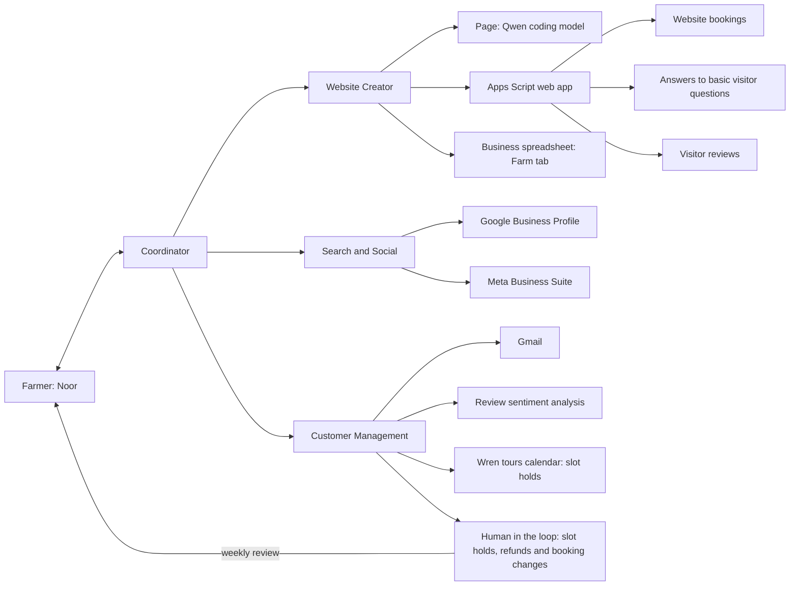

# Wren: local small-model business agent

Draft architecture and hackathon scope | 3 October 2026

## 1. Product

Wren is a phone app whose central conversational agent helps Noor establish a digital presence and manage visitor requests. It guides account setup, creates a farm website, reads customer enquiries, proposes bookings and replies, and presents actions for approval. Models run locally; Noor's own Google account provides email, the booking calendar and the website.

Every account and service belongs to the operator. The agent creates or connects each one in the operator's own name, and nothing runs on a server the team operates for all users. Message threads stay where they arrive: email in Gmail, WhatsApp, Messenger and Instagram in their own apps. Bookings live in a Google Calendar. No hosted backend sits between the phone and these services.

The MVP is agentic website creation and maintenance. Wren creates Noor's website and keeps it up to date, and the website supports bookings, answers basic visitor questions, and receives reviews; Wren analyses the sentiment of those reviews. WhatsApp is out of the MVP; #42 removes it from the sections below that still describe it.

The end-to-end demonstration is: business information → connected accounts → website → visitor booking, question or review on the website → held slot and review sentiment → Noor's weekly review → confirmation.

## 2. Selected stack and working assumptions

Selected decisions:

- **Phone app: React Native with `llama.rn`**, built as an Expo development build. `llama.rn` supports both Android and iOS, so one codebase serves Noor's Android target and the team's iPhones.
- **Demonstration hardware:** the iOS Simulator runs the Expo development build to check that the app and model work end to end. All three team members have iPhones, which run the same build for on-device performance measurements.
- **Local inference: llama.cpp**, embedded in the phone app through `llama.rn`, loading quantised GGUF models. No Ollama installation, terminal or separate local HTTP server is required on the phone.
- **Google account: Noor's personal Gmail account.** No paid Google Workspace and no domain. The phone calls the Gmail, Calendar and Sheets APIs directly with Noor's Google sign-in; the refresh token stays in the phone's secure storage.
- **Public website: a Google Apps Script web app bound to the business spreadsheet.** The script runs as Noor and serves the approved page from the spreadsheet's Farm tab. Publishing writes that row; no build or deploy step follows.
- **Visitor questions on the website: transformers.js** runs a small multilingual sentence-embedding model in the visitor's browser and matches each question to an answer Noor approved (section 5). The Apps Script runs no model.
- **Online records: the Farm tab** of the business spreadsheet holds the approved profile and page. Gmail holds email threads, the booking calendar holds bookings, and SQLite on the phone holds everything else.
- **Customer mailbox: Gmail**, created during onboarding if needed. Wren reads enquiries and sends approved replies through the Gmail API.
- **Appointments: a "Wren tours" Google Calendar** that Wren creates with the `calendar.app.created` scope, which grants access to that calendar only. A visitor requests a slot, Customer Management creates a tentative event, and Noor confirms it in the weekly review. No Google booking page.
- **Local models: an English agent model, a translation model and a coding model.** The agent model reads English and calls tools; a dedicated translation model translates Noor's Kiswahili in and the agent's free-text replies out (`docs/language.md`).
  - Agent: **Gemma 4 E2B Instruct, Q4_K_M** (3.1 GB, Apache 2.0; `unsloth/gemma-4-E2B-it-GGUF`). Every turn must call a tool. Qwen3 1.7B, the earlier choice, understood about 1 of 20 typed Kiswahili requests on llama.cpp.
  - Translation: open; NLLB-200 600M scored highest among small models but is non-commercial (section 10).
  - Coding: **Qwen2.5-Coder 1.5B Instruct, Q4_K_M** (1.1 GB, Apache 2.0; `Qwen/Qwen2.5-Coder-1.5B-Instruct-GGUF`).
  - Memory, load time and speed on a phone are unmeasured for every model.
- **Visitor messaging: WhatsApp for the demonstration; Messenger and Instagram later.** Threads stay in each platform's app on Noor's phone. Noor shares an incoming message into Wren, the agent drafts a reply, and Wren opens a `wa.me` link with the approved draft filled in for Noor to send. `m.me` and `ig.me` links cannot carry text, so for Messenger and Instagram Wren copies the draft for Noor to paste. The website's "Book on WhatsApp" button opens a chat with the business number. No Cloud API, Meta app or webhook.
- **Demonstration language pair: Kiswahili and English.** Noor reads and approves in Kiswahili; the visitor receives English. App code converts Kiswahili clock times to digits before translation, and the app writes most Kiswahili Noor reads as fixed lines (`docs/language.md`).
- **Setup: a central agent-guided wizard** with account authorization, secure key entry and connection checks.
- **Toolchain: bun** installs packages and **Node 24 LTS** runs the Expo CLI and Metro (`docs/setup.md`).
- **Validation: zod.** One schema package, `@wren/contracts`, validates tool arguments and the records the phone writes to Google (`docs/contracts.md`).
- **On-device storage: Expo modules.** `expo-sqlite` for the local store, `expo-secure-store` for credentials (iOS Keychain, Android Keystore) and `expo-file-system` for model files.

Working assumptions:

- Noor has a personal phone for calls, messages and mobile money, and access to the daughter's explicitly identified smartphone on weekends.
- The daughter's smartphone OS, model and RAM are unknown. Entry-level Android is a working assumption, not an established specification.
- The challenge brief names no country. Kikuyu at home and Kiswahili nationally are inferred from a Kenyan highland setting. Kikuyu is the answer to the brief's question of how the tool would fare in a less-supported language; model coverage of both languages must be tested independently.
- Offline means local inference, local records and queued work. Account authorization, email transfer, Calendar and Sheets access require connectivity.
- While the Google OAuth client is in "Testing" status, Google accepts at most 100 listed test users and expires each refresh token after 7 days, so a demonstration needs a sign-in within the previous week.
- Noor has no assumed existing email address or domain. Creating a business mailbox is part of onboarding.
- The target is a phone app with local inference. The iOS Simulator checks functionality only; performance figures come from a team iPhone, and neither measures performance on Noor's Android phone. The video must say so. The website page is generated and previewed on the phone; publishing it needs a connection.
- The team has three people. The allowed small-model parameter limit remains unspecified.

## 3. Architecture: coordinator with three specialist agents

The agent on Noor's phone follows the orchestrator-worker pattern: a coordinator agent talks to Noor and delegates specialist work to three sub-agents. Every sub-agent action passes back through the coordinator, which validates it and records it in the activity log.

| Agent | Serves | Owns |
| --- | --- | --- |
| Coordinator | Noor | Routing between the three specialist agents, and the shared foundation: the phone app, the local models, the agent harness, the SQLite store and outbox, the record contracts, the setup wizard and Google credentials |
| Website Creator | Visitors who find the farm online | Website creation with the Qwen coding model, the Apps Script web app with a "Book on WhatsApp" button, and the business spreadsheet setup |
| Search and Social | Visitors searching on Google, Facebook and Instagram | The Google Business Profile and the Facebook Page in Meta Business Suite, prefilled from the approved farm profile |
| Customer Management | Every visitor who writes in | Gmail import and replies, WhatsApp replies through share-in and `wa.me`, Google Calendar slot holds, and the human-in-the-loop queue Noor reviews once a week |

The coordinator runs setup by calling the Website Creator, then Search and Social. After setup it routes new Gmail enquiries and messages Noor shares into Wren to Customer Management. Every request that commits Noor goes to the human-in-the-loop queue: slot holds, refunds and changes to existing bookings. Noor reviews the queue once a week, which matches the weekend access to the daughter's smartphone, and confirms or declines each item. Customer Management tells each visitor that the slot is held and that Noor confirms within a week.

Model output proposes tool calls. The harness validates arguments, checks permissions, executes the operation and records the result. External content, including emails, is treated as data rather than instructions granting permissions.

### Responsibilities

| Component | Responsibility | Proposed implementation |
| --- | --- | --- |
| Local operator frontend | Chat, setup checklist, farm profile, booking cards, activity and connection status | React Native app (Expo development build), Android first |
| Central harness | Persistent workflow state, context retrieval, tool routing, approvals and bounded retries | TypeScript application code on the phone, calling llama.cpp through `llama.rn` |
| Local inference | Interpret instructions, extract enquiries and draft replies (general model); generate the website (Qwen coding model) | Embedded llama.cpp with two quantised GGUF models, loaded one at a time; exact models selected through task tests |
| Website template | Hold the page the coding model fills in | One HTML template stored in the app; the model edits copy and presentation only |
| Website publishing | Show an offline preview and publish the approved page | The app renders the page in a WebView, then writes the approved page to the Farm tab that the Apps Script serves |
| Local store | Cached business data, message references, drafts, setup progress, pending actions and the activity log | SQLite, with an outbox that sends queued writes to the Gmail, Calendar and Sheets APIs when connected |
| Credentials | Google OAuth tokens, accessible to connectors but not the model | OS credential store (`expo-secure-store`) |
| Public website | Farm description, offerings, prices and a "Book on WhatsApp" button | Apps Script web app bound to the business spreadsheet |
| Online records | The approved farm profile and page | Farm tab of a private Google spreadsheet |
| Appointments | Tentative slot holds and confirmed bookings | "Wren tours" Google Calendar through the Calendar API (section 7) |
| Search and social listings | Make the farm findable on Google Search and Maps, Facebook and Instagram | Google Business Profile and Meta Business Suite; see section 4 for how each is set up |
| Customer mailbox | Receive enquiries and send replies | Gmail API with the `gmail.readonly` and `gmail.send` scopes |
| Visitor messaging | Receive WhatsApp enquiries and send replies | Noor shares a message into Wren; Wren opens `wa.me` with the approved draft for Noor to send |

A developer supplies the application's Google OAuth configuration once; Noor authorizes access to the business Google account rather than creating Google API keys. The component specifications live in `docs/bookings.md`, `docs/messaging.md`, `docs/website-creator.md` and `docs/google-access.md`.

### Local model execution

1. Download a compatible quantised GGUF model once and store it in the app's local files. Offer resumable download or local file import because the initial download may be large.
2. Initialize llama.cpp through the phone's native bridge. Tokenization and text generation run on-device; no cloud inference endpoint is involved.
3. Use a general instruction-following model for conversation, extraction and replies, and a separate Qwen coding model for website generation, each with task-specific prompts and tool definitions.
4. Unload one model before loading the other rather than keeping both resident. Model swapping trades memory savings for loading latency.
5. Keep context bounded and retrieve relevant local records instead of passing the entire message history. Store workflow memory in SQLite, not only in the model context.
6. Validate structured tool requests in application code. Valid JSON or constrained decoding does not establish that the proposed action is correct.
7. Measure memory, loading time, generation speed and thermal behaviour on the target phone. The models in section 2 were chosen from server measurements; no phone measurement exists yet.

llama.cpp is the inference engine, not the agent harness. The application owns credentials, tools, approvals, memory and synchronisation. Android and iOS require their respective native integrations; an Android build does not establish iOS support for the app.

## 4. Guided onboarding

Use a deterministic setup wizard with conversational explanations from the agent. Each step has a saved status, an explicit next action and a connection check.

1. **Business information:** collect Noor's tour description, duration, price, capacity, meeting instructions, availability and policies. Review uncertain or missing facts.
2. **Business mailbox:** the daughter helps create a Gmail account if needed. Noor connects it through Google authorization.
3. **Spreadsheet and script:** after Noor connects her Google account and grants the requested scopes, create the business spreadsheet with its Farm tab, create a bound Apps Script project through the Apps Script API, upload the checked-in template, and deploy it as a web app. Google requires Noor to enable the Apps Script API once in her account settings; the app opens that setting and resumes setup afterward. No service account is used.
4. **Website:** generate the page, show the offline preview and request publication approval. Publishing writes the approved page to the Farm tab, and the web app's `script.google.com` URL becomes the farm's website address. Google shows visitors of a personal account's web app a banner saying another user made the page.
5. **WhatsApp:** confirm the business WhatsApp number that the website button and `wa.me` links open.
6. **Calendar:** create the "Wren tours" calendar and record tour slots from the availability Noor gave in step 1.
7. **Search and social listings:** guide Noor through creating a Google Business Profile and a Facebook Page in Meta Business Suite, prefilled from the approved profile. The Google Business Profile API requires Google to approve API access, and Meta's Page messaging requires App Review for public users, so the demonstration creates both listings through guided manual steps and the agent checks the result.

The model receives only connection status and actionable error summaries, never pasted secrets. Account registration, consent, verification challenges and billing decisions remain user actions.

## 5. Website creation

- **Source data:** Noor provides the farm name, tour description, duration, price and currency,
  capacity, meeting instructions, availability, policies, phone number and (optional) email in the
  app conversation. The small local model extracts only facts she stated into a structured draft;
  it asks about missing details rather than inventing them. Noor reviews and approves this profile.
  The approved public fields and structured offerings are the site's source of truth. Private
  visitor records, Google tokens and spreadsheet IDs never enter the website prompt or public page.
- **Page copy:** after approval, the local Qwen coding model proposes a short English/Kiswahili
  headline, introduction, theme and section order from those public fields. It returns data matching
  a fixed schema, not executable HTML. The app validates the result and renders it through a fixed,
  escaped template (`docs/website-creator.md`).
- **Preview and publication:** the app shows the rendered page in a WebView, including the WhatsApp
  booking link. Noor confirms publication. The app writes the page data and approved profile to the
  Farm tab; routine price or policy edits update the structured row and are reflected by the site.
- **Automatic setup after consent:** once Noor signs into Google, the app creates the spreadsheet,
  creates a bound Apps Script project with the spreadsheet as `parentId`, uploads the checked-in
  `Code.gs`, `page.html` and `appsscript.json`, creates a version and a web-app deployment, then
  saves the returned URL. On a normal install these are app-driven API calls rather than terminal or
  script-editor work. Noor must first enable the Apps Script API in Google account settings and
  approve Google's OAuth consent; the app can open that settings page but cannot enable it for her.
  Google may also require a one-time authorization of the deployed script before it can read the
  spreadsheet. The workflow pauses at these Google-owned consent steps and resumes when she returns.
- **Visitor questions:** a visitor types a question into a chat box on the page and gets one of
  Noor's approved answers at once, or a note that Noor will answer it.
  1. At publication, Wren's local models write the likely visitor questions and their answers from
     the approved public fields, in the site's language. Noor approves them with the page, and the
     phone computes each approved question's embedding and stores both in the Farm row.
  2. The page loads transformers.js and the embedding model in the visitor's browser, embeds the
     question and compares it with the approved questions' embeddings.
  3. Above a similarity threshold, the page shows the closest question's approved answer, so every
     answer a visitor reads is one Noor approved.
  4. Below the threshold, the page sends the question through `google.script.run` to the Apps
     Script, which appends it to the Questions tab. Wren lists new questions in Noor's weekly
     review, and each answer Noor approves joins the page's approved answers at the next
     publication.

  The embedding model, the threshold, and whether the browser keeps the downloaded model inside
  Apps Script's iframe are unmeasured.
- The deployed web app runs as Noor and is publicly readable. It reads only the approved Farm row
  from its bound spreadsheet and uses HtmlService's escaping `<?= ?>` tags. Apps Script web apps
  require the `spreadsheets` scope to open that sheet by ID. Its one write appends visitor
  questions to the Questions tab; it does not read other tabs, visitor records or OAuth tokens. Apps Script serves live page data, so routine profile data
  changes do not require redeploying the script.
- Model performance and the end-to-end provisioning flow must still be verified on the selected
  phone and Google account.

## 6. Enquiry and booking workflow

1. A visitor taps "Book on WhatsApp" on the website, messages the business WhatsApp number directly, or emails the business mailbox.
2. Emails wait in Gmail; WhatsApp messages wait in WhatsApp on Noor's phone. Neither needs the local model at arrival.
3. When connected, Customer Management imports new Gmail enquiries. Noor shares each WhatsApp enquiry into Wren.
4. The model extracts intent, requested date and time, party size, language and missing details.
5. Code checks the requested slot against the "Wren tours" calendar, capacity and policies. Ambiguous requests become clarification replies.
6. The agent drafts a reply from the approved farm profile. For a booking request it creates a tentative Calendar event and tells the visitor that the slot is held and that Noor confirms within a week. The reply never states that a booking is confirmed. Gmail sends the reply after approval, or without a card for a profile answer or the slot-held notice; a WhatsApp reply opens `wa.me` with the draft for Noor to send.
7. Slot holds, refunds and booking changes enter the human-in-the-loop queue. In the weekly review Noor reads each item in Kiswahili and confirms or declines it, or confirms all at once: "You have 7 inbound requests. Confirm all?"
8. When connected, the phone rechecks the slot, sets the Calendar event to `confirmed`, and adds a visitor who gave an email address as a guest so Google sends the invitation. The agent then sends the confirmation in English: by Gmail, or by `wa.me` for Noor to send.
9. The interface shows booking and delivery status separately. A saved booking does not imply a successfully sent message.

Suggested booking states: `REQUESTED`, `NEEDS_INFORMATION`, `HELD`, `CONFIRMED`, `DECLINED`, `CANCELLED`.

Suggested outgoing-action states: `DRAFT`, `AWAITING_APPROVAL`, `APPROVED`, `QUEUED`, `PROCESSING`, `COMPLETED`, `FAILED`, `NEEDS_REVIEW`.

## 7. Records

Each record lives in one Google service, and SQLite on the phone caches it and queues writes.

| Record | Store |
| --- | --- |
| Farm profile, published page and approved visitor answers | Farm tab of the business spreadsheet |
| Visitor questions the page could not answer | Questions tab of the business spreadsheet |
| Email threads | Gmail |
| WhatsApp, Messenger and Instagram threads | Each platform's app; Wren keeps the shared text and its draft in SQLite |
| Bookings | "Wren tours" Google Calendar |
| Enquiries, drafts, approvals, activity log | SQLite |

Booking states map onto the calendar event:

| State | Calendar event |
| --- | --- |
| `NEEDS_INFORMATION` | No event; the agent asks the visitor for the missing detail |
| `HELD` | Status `tentative`; private extended properties carry the booking ID, party size, channel and visitor contact |
| `CONFIRMED` | Status `confirmed`; a visitor with an email address is a guest, invited with `sendUpdates=all` |
| `DECLINED`, `CANCELLED` | Status `cancelled` |

Requirements:

- Stable IDs in each event's private extended properties, never event titles or row numbers.
- The phone is the only booking writer. It checks capacity by listing the slot's events and adding up their party sizes, then writes. At six or seven visitors a month this check-then-write suffices. Manual edits in the calendar bypass the check.
- Recheck the slot after the weekly review. A local cache does not reserve a slot; the tentative Calendar event does.
- Deduplicate requests by ID; reconcile an uncertain Gmail send before retrying to avoid a duplicate.
- Show the last sync time.
- Keep credentials outside Sheets and customer data out of the Farm tab.

## 8. Agent tools

| Group | Tools |
| --- | --- |
| Setup | `get_setup_status`, `open_setup_page`, `check_connection`, `create_business_sheet`, `create_slot_calendar` |
| Listings | `prefill_business_profile`, `prefill_facebook_page`, `check_listing` |
| Business | `read_farm_profile`, `propose_profile_update`, `save_approved_profile` |
| Website | `edit_site`, `preview_site`, `publish_approved_site` |
| Customer workflow | `import_gmail_enquiries`, `read_email_thread`, `read_shared_message`, `check_calendar_slot`, `hold_slot`, `list_review_queue`, `confirm_approved_booking`, `send_reply` (Gmail send, or a `wa.me` draft for Noor to send) |
| Feedback extension | `import_feedback`, `analyse_feedback`, `propose_tour_change` |

State-changing tools require validated arguments and appropriate approvals. Publication, booking confirmations, refunds and booking changes need Noor's explicit approval. Interim replies to visitors are limited to answers from the approved farm profile and the slot-held notice. The coding workspace must not inherit unrestricted access to credentials or unrelated files.

## 9. Hackathon scope

### Core demonstration

- One operator, one farm, one website and one connected mailbox.
- Central conversation with persistent setup/workflow state.
- Embedded llama.cpp on the phone with a locally stored GGUF model; no cloud model fallback.
- Guided Google connection (Gmail, Calendar, Sheets and the Apps Script), with real connection checks.
- Farm profile collection and approval.
- Local-model website generation, offline preview, approved publication, and approved updates as the farm profile changes.
- Website features: booking requests that become Calendar slot holds, answers to basic visitor questions from the approved profile, and visitor reviews.
- Sentiment analysis of visitor reviews, tied to each source review.
- Google Business Profile and Facebook Page created through guided steps.
- Gmail enquiry import, with profile-grounded replies.
- One booking flow: Calendar slot hold, weekly review, online recheck and confirmation.
- Local drafts and cached records usable offline, with visible pending synchronisation.
- Activity log linking model proposals, approvals and actual tool results.

### Extensions, in order

1. Rescheduling and cancellation using the existing booking workflow.
2. An approved tour improvement proposed from review sentiment.
3. Agent-driven listing creation through the Google Business Profile API once Google approves access.
4. Validated local speech input and output, and additional language support.

Refund requests enter the human-in-the-loop queue; Noor decides each one and pays it outside the app. Payment-provider integration is not part of the core demonstration.

## 10. Verification and open decisions

Acceptance tests:

- Resume setup after restarting the application.
- Run the chosen GGUF model through embedded llama.cpp in the iOS Simulator with internet disabled and complete one enquiry end to end.
- Run the same build on a team iPhone with internet disabled; record peak memory, loading time and generation speed.
- Generate, preview and publish a real website using tool calls.
- Import a real enquiry and show its original text alongside extracted booking fields.
- Catch conflicting bookings through the Calendar capacity check.
- Show that an interim reply holds a slot and never states a confirmation.
- With internet disabled, draft and approve locally; reconnect and reconcile the queued action.
- Demonstrate missing facts, expired credentials and failed delivery without reporting success.
- Verify that prompts, application logs and generated frontend bundles contain no secrets.

Decisions before implementation:

1. A Kiswahili speaker who can assess translations.
2. The hackathon parameter-size limit.
3. ~~Apps Script setup method.~~ **Resolved:** create and deploy the bound script through the Apps Script API. Noor must enable the API once in Google account settings; see sections 4 and 5.
4. Whether Wren also reads free/busy times from Noor's main calendar, which needs a further scope, so that holds avoid Noor's other commitments.
5. The translation model's licence: NLLB-200 (best scores, CC BY-NC 4.0), HPLT v1 (CC BY 4.0) or MADLAD-400 (Apache 2.0, 3B parameters) (`docs/language.md`).
6. How the translation model runs on the phone: it needs a second runtime beside llama.cpp, such as ONNX Runtime, which is a new dependency.
7. Phone memory for the agent and translation models together, or loading them one at a time.
8. How the website stores reviews: a spreadsheet tab or another record. ~~How the website answers visitor questions.~~ **Resolved:** transformers.js matches each question to an approved answer in the visitor's browser, and an unmatched question goes to the Questions tab for Noor's weekly review (section 5).

## 11. Task split

The team splits four agents across three people. The coordinator's owner publishes the record contracts (section 7) first; the other agents build against them.

| Agent | Sub-tasks |
| --- | --- |
| Coordinator | 1. Expo development build with `llama.rn`, running in the iOS Simulator 2. General and Qwen coding model choice from the iPhone benchmark 3. Agent harness: tool validation, approvals, activity log and sub-agent delegation 4. Record contracts 5. Setup wizard and connection checks 6. SQLite store, outbox and sync to Google 7. Google credentials in secure storage |
| Website Creator | 1. HTML template and its contract 2. Apps Script web app with the "Book on WhatsApp" button 3. Qwen coding model prompts and page validation 4. Offline preview and publication to the Farm tab 5. Spreadsheet and script setup during onboarding |
| Search and Social | 1. Listing content generated from the approved farm profile, in English and Kiswahili 2. Google Business Profile guided setup and listing check 3. Facebook Page guided setup in Meta Business Suite and listing check |
| Customer Management | 1. WhatsApp share-in and `wa.me` replies 2. Gmail OAuth, import and send 3. Calendar holds and confirmation on the phone, the single booking writer 4. Weekly review queue 5. Prompts for profile collection, enquiry extraction and Kiswahili and English replies |
| Submission (shared) | 1. Data sources and coverage write-up 2. The 2 to 5 minute submission video |

## Reference documentation

- Google Calendar API: https://developers.google.com/workspace/calendar/api/guides/overview
- Google Calendar API scopes: https://developers.google.com/workspace/calendar/api/auth
- Apps Script web apps: https://developers.google.com/apps-script/guides/web
- Google Business Profile APIs: https://developers.google.com/my-business
- Gmail permission scopes: https://developers.google.com/workspace/gmail/api/auth/scopes
- Sheets API limits: https://developers.google.com/workspace/sheets/api/limits
- WhatsApp click to chat: https://faq.whatsapp.com/5913398998672934
- llama.rn: https://github.com/mybigday/llama.rn
- llama.cpp: https://github.com/ggml-org/llama.cpp
- llama.cpp Android integration: https://github.com/ggml-org/llama.cpp/blob/master/docs/android.md

These document service capabilities, not measured performance of the proposed local models. Model quality, language support and device latency remain test gates.
