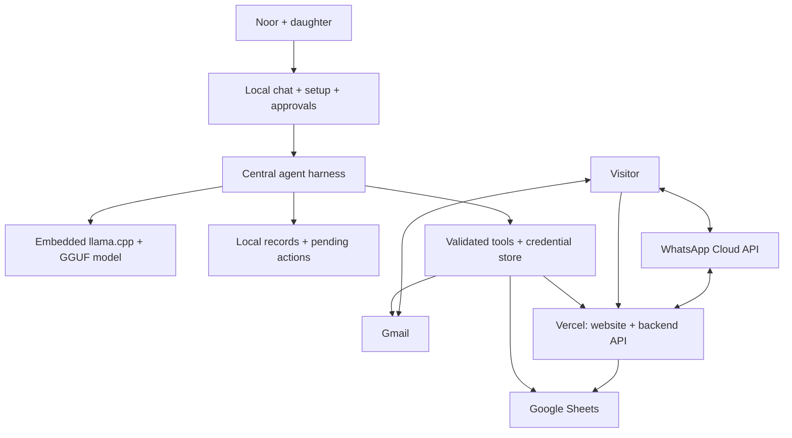

# Noor: local small-model business agent

Draft architecture and hackathon scope | 3 October 2026

## 1. Product

A central conversational agent helps Noor establish a digital presence and manage visitor requests. It guides account setup, creates a farm website, reads customer enquiries, proposes bookings and replies, and presents actions for approval. Models run locally; external services provide hosting, email and shared records.

The end-to-end demonstration is: business information → connected accounts → website preview → approved publication → customer enquiry → approved booking and response.

## 2. Selected stack and working assumptions

Selected decisions:

- **Phone app: React Native with `llama.rn`**, built as an Expo development build. `llama.rn` supports both Android and iOS, so one codebase serves Noor's Android target and the team's iPhones.
- **Demonstration hardware:** the iOS Simulator runs the Expo development build to check that the app and model work end to end. All three team members have iPhones, which run the same build for on-device performance measurements.
- **Local inference: llama.cpp**, embedded in the phone app through `llama.rn`, loading quantised GGUF models. No Ollama installation, terminal or separate local HTTP server is required on the phone.
- **Online backend data store: Google Sheets**, accessed through validated backend endpoints.
- **Public website and backend API: Next.js on Vercel.**
- **Customer mailbox: Gmail**, created during onboarding if needed.
- **Visitor messaging: WhatsApp.** The WhatsApp Cloud API sends and receives messages through the backend. A `wa.me` deep link, which opens WhatsApp with the approved draft filled in for Noor to send, serves as the offline and failure fallback.
- **Demonstration language pair: Kiswahili and English.** Noor reads and approves in Kiswahili; the visitor receives English.
- **Setup: a central agent-guided wizard** with account authorization, secure key entry and connection checks.

Working assumptions:

- Noor has a personal phone for calls, messages and mobile money, and access to the daughter's explicitly identified smartphone on weekends.
- The daughter's smartphone OS, model and RAM are unknown. Entry-level Android is a working assumption, not an established specification.
- The challenge brief names no country. Kikuyu at home and Kiswahili nationally are inferred from a Kenyan highland setting. Kikuyu is the answer to the brief's question of how the tool would fare in a less-supported language; model coverage of both languages must be tested independently.
- Offline means local inference, local records and queued work. Account authorization, email transfer, Sheets access and deployment require connectivity.
- Noor has no assumed existing email address or domain. Creating a business mailbox is part of onboarding.
- The target is a phone app with local inference. The iOS Simulator checks functionality only; performance figures come from a team iPhone, and neither measures performance on Noor's Android phone. The video must say so. Generated website source is uploaded when connected; the build and deployment run online rather than requiring a Node.js build environment on the phone.
- The team has three people. The allowed small-model parameter limit remains unspecified.

## 3. Architecture

Model output proposes tool calls. The harness validates arguments, checks permissions, executes the operation and records the result. External content, including emails, is treated as data rather than instructions granting permissions.

### Responsibilities

| Component | Responsibility | Proposed implementation |
| --- | --- | --- |
| Local operator frontend | Chat, setup checklist, farm profile, booking cards, activity and connection status | React Native app (Expo development build), Android first |
| Central harness | Persistent workflow state, context retrieval, tool routing, approvals and bounded retries | TypeScript application code on the phone, calling llama.cpp through `llama.rn` |
| Local inference | Interpret instructions, extract enquiries, draft replies and generate website changes | Embedded llama.cpp with quantised GGUF; exact model selected through task tests |
| Website source workspace | Read and edit generated site files within a constrained workspace | Next.js starter stored locally; no unrestricted phone shell |
| Website build pipeline | Run checks, build, return preview and publish approved changes | Hosted build/deployment pipeline with pinned dependencies; Vercel receives generated source through a deployment connector |
| Local store | Cached business data, message references, drafts, setup progress and pending actions | SQLite |
| Credentials | OAuth tokens and service keys, accessible to connectors but not the model | OS credential store or encrypted local storage; managed secrets for hosted services |
| Public website | Farm description, offerings, contact and booking request form | Next.js on Vercel |
| Hosted backend | Validate public submissions, persist requests, serve approved public content and process approved commands | Next.js API routes on Vercel |
| Online records | Shared business profile, availability, enquiries, bookings, feedback and action receipts | Private Google Sheets |
| Customer mailbox | Receive enquiries and send Noor-approved responses | Gmail API with OAuth |
| Visitor messaging | Receive WhatsApp enquiries and send Noor-approved replies | WhatsApp Cloud API; a webhook on a Vercel API route stores incoming messages in Sheets, and the access token stays on Vercel. A `wa.me` deep link opens WhatsApp with the approved draft when the phone is offline or the API call fails |

A developer supplies the application's Google OAuth configuration once; Noor authorizes access to the business Google account rather than creating Google API keys. The team also owns the Meta app and the WhatsApp test number for the demonstration. A production deployment would connect Noor's own number through Meta's Embedded Signup, which requires a verified Meta Business portfolio.

### Local model execution

1. Download a compatible quantised GGUF model once and store it in the app's local files. Offer resumable download or local file import because the initial download may be large.
2. Initialize llama.cpp through the phone's native bridge. Tokenization and text generation run on-device; no cloud inference endpoint is involved.
3. Start with one instruction-following model for conversation and coding, using task-specific prompts and tool definitions. A separate coding model is added only if evaluation justifies it.
4. If two models are used, unload one before loading the other rather than keeping both resident. Model swapping trades memory savings for loading latency.
5. Keep context bounded and retrieve relevant local records instead of passing the entire message history. Store workflow memory in SQLite, not only in the model context.
6. Validate structured tool requests in application code. Valid JSON or constrained decoding does not establish that the proposed action is correct.
7. Benchmark memory, loading time, generation speed and thermal behaviour on the actual target phone before fixing the model and quantisation. Model choice remains open; runtime choice does not.

llama.cpp is the inference engine, not the agent harness. The application owns credentials, tools, approvals, memory and synchronisation. Android and iOS require their respective native integrations; an Android build does not establish iOS support for the app.

## 4. Guided onboarding

Use a deterministic setup wizard with conversational explanations from the agent. Each step has a saved status, an explicit next action and a connection check.

1. **Business information:** collect Noor's tour description, duration, price, capacity, meeting instructions, availability and policies. Review uncertain or missing facts.
2. **Business mailbox:** the daughter helps create a Gmail account if needed. Noor connects it through Google authorization.
3. **Records:** authorize Sheets access and create the predefined spreadsheet tabs. Use separate, narrowly scoped credentials for hosted access; a prototype service account can be granted access to the designated spreadsheet.
4. **Hosting:** create or connect a Vercel account. For the prototype, guide token creation and collect it in a secure field. A Vercel integration authorization flow is a later improvement.
5. **Website:** generate a preview and request publication approval. A Vercel-provided URL avoids requiring a custom domain for the demo.
6. **WhatsApp:** confirm the business WhatsApp number and run a connection check against the Cloud API. In the demonstration the number is the team's Meta test number.

The model receives only connection status and actionable error summaries, never pasted secrets. Account registration, consent, verification challenges and billing decisions remain user actions.

## 5. Website creation

- Start from a working Next.js project with a booking form and backend contract already implemented.
- Website generation remains part of the product. The generation method is an open decision with two candidates:
  - **Template:** the local model chooses among predefined section and layout variants, writes the page text in English and Kiswahili, and fills in the approved profile. This costs one small model call per section and gives a predictable demonstration.
  - **Code generation:** the local coding model edits layout, text, colours and approved images in the Next.js source. This requires a stronger coding model and the repair loop below.
- When connected, upload the generated source and run type checks, application tests and a production build in the hosted pipeline. Feed failures back to the local model for a bounded repair loop.
- Return a hosted preview. Publish only after approval. Offline generation does not imply offline Next.js build verification.
- Keep everyday descriptions, prices and availability as structured data so routine changes need not regenerate source code.
- Publish only approved public fields. Never expose the spreadsheet, customer records, OAuth tokens or API keys through the frontend.

The phone generates and edits source locally; the hosted pipeline builds and deploys it. Next.js and Vercel are retained. Arbitrary shell execution and a full Node.js installation on the phone are not required. Native integration and model performance must still be verified on the selected phone.

## 6. Enquiry and booking workflow

1. A visitor submits the website form, emails the business mailbox or sends a WhatsApp message.
2. The hosted API stores form submissions and incoming WhatsApp messages in Sheets; incoming emails remain in Gmail until the local connector imports them. None of these requires the local model to be online at arrival.
3. When the agent runs and connectivity is available, it downloads new requests and messages.
4. The model extracts intent, requested date/time, party size, language and missing details. It drafts a grounded response using the approved farm profile.
5. Code checks availability, capacity and policies. Ambiguous requests become clarification drafts.
6. Noor reviews a booking card and the reply in Kiswahili; the visitor receives the English version.
7. Approval queues a command. On reconnection, the backend rechecks current availability, records the booking and returns a receipt before the agent sends a confirmation on the channel the visitor used: Gmail, or WhatsApp through the Cloud API. When the Cloud API call fails, the app opens the `wa.me` deep link with the approved text for Noor to send.
8. The interface shows booking and delivery status separately. A saved booking does not imply a successfully sent message.

Suggested booking states: `REQUESTED`, `NEEDS_INFORMATION`, `PROPOSED`, `CONFIRMED`, `DECLINED`, `CANCELLED`.

Suggested outgoing-action states: `DRAFT`, `AWAITING_APPROVAL`, `APPROVED`, `QUEUED`, `PROCESSING`, `COMPLETED`, `FAILED`, `NEEDS_REVIEW`.

## 7. Sheets backend requirements

Google Sheets is the selected online backend data store. The backend API supplies authentication, validation and booking operations; SQLite supplies offline cache and pending actions, not an alternative online backend.

| Tab | Main fields |
| --- | --- |
| Farm | Profile ID, approved public content, offerings, prices, policies, version |
| Availability | Slot ID, date/time, capacity, closures |
| Enquiries | Request ID, source, customer ID, original message, extracted fields, status |
| Bookings | Booking ID, request ID, slot ID, party size, status, version |
| Messages | Message ID, thread ID, request ID, draft, approval and delivery status |
| Feedback | Feedback ID, booking ID, original comment, language, analysis |
| Actions | Action ID, type, approval reference, outcome, timestamps |

Requirements:

- Stable IDs, timestamps and record versions, not row numbers as identifiers.
- Authentication for operator/agent endpoints, validation and abuse controls on public forms.
- One controlled confirmation writer: the Vercel booking endpoint checks availability and writes the booking, and every confirmation path goes through it. At six or seven visitors a month this check-then-write is sufficient for the demonstration. Manual edits in the spreadsheet bypass the check; an Apps Script `LockService` critical section is the upgrade if concurrent writers appear.
- Recheck availability after offline approval. A local cache does not reserve a slot.
- Deduplicate requests and commands by ID; reconcile uncertain email and WhatsApp outcomes before retrying to avoid duplicate sends.
- Batch synchronisation and show the last sync time.
- Keep credentials outside Sheets and customer data out of publicly served profile responses.

## 8. Agent tools

| Group | Tools |
| --- | --- |
| Setup | `get_setup_status`, `open_setup_page`, `check_connection`, `create_business_sheet` |
| Business | `read_farm_profile`, `propose_profile_update`, `save_approved_profile` |
| Website | `edit_site`, `test_site`, `deploy_preview`, `publish_approved_site` |
| Customer workflow | `sync_enquiries`, `read_email_thread`, `read_whatsapp_thread`, `check_availability`, `propose_booking`, `confirm_approved_booking`, `send_approved_reply` (Gmail or WhatsApp, with the deep-link fallback) |
| Feedback extension | `import_feedback`, `analyse_feedback`, `propose_tour_change` |

State-changing tools require validated arguments and appropriate approvals. Publication and customer messages need explicit approval. The coding workspace must not inherit unrestricted access to credentials or unrelated files.

## 9. Hackathon scope

### Core demonstration

- One operator, one farm, one website, one connected mailbox and one WhatsApp number.
- Central conversation with persistent setup/workflow state.
- Embedded llama.cpp on the phone with a locally stored GGUF model; no cloud model fallback.
- Guided Google, Vercel and WhatsApp connection, with secure credential entry and real connection checks.
- Farm profile collection and approval.
- Local-model website generation, build verification, preview and approved deployment.
- Website form, Gmail and WhatsApp enquiry import.
- One booking flow with availability validation, approval, online recheck and customer response.
- Local drafts and cached records usable offline, with visible pending synchronisation.
- Activity log linking model proposals, approvals and actual tool results.

### Extensions, in order

1. Rescheduling and cancellation using the existing booking workflow.
2. Feedback analysis tied to source comments and an approved tour improvement.
3. Social presence and marketing integrations from the whiteboard.
4. Validated local speech input/output and additional language support.

Payments and refunds require separate payment-provider integration and approval design. They are not claimed in the core demonstration.

## 10. Verification and open decisions

Acceptance tests:

- Resume setup after restarting the application.
- Run the chosen GGUF model through embedded llama.cpp in the iOS Simulator with internet disabled and complete one enquiry end to end.
- Run the same build on a team iPhone with internet disabled; record peak memory, loading time and generation speed.
- Create, build, preview and publish a real website using tool calls.
- Import a real enquiry and show its original text alongside extracted booking fields.
- Catch conflicting bookings through the controlled online writer.
- With internet disabled, draft and approve locally; reconnect and reconcile the queued action.
- Demonstrate missing facts, expired credentials and failed delivery without reporting success.
- Verify that prompts, application logs and generated frontend bundles contain no secrets.

Decisions before implementation:

1. A Kiswahili speaker who can assess translations.
2. Exact local model, quantisation and hackathon parameter-size limit; whether a separate coding model is justified by tests.
3. Website generation method: template or code generation (section 5).
4. Details of the user-owned Vercel onboarding and hosted source-upload/build connector.

## 11. Task split

The backend role publishes the Sheets schema (section 7) and the API route contracts first; the other two roles build against them.

| Role | Sub-tasks |
| --- | --- |
| Backend and integrations | 1. Sheets schema, tab creation and API route contracts 2. Booking endpoint as the single confirmation writer 3. Gmail OAuth, import and send 4. WhatsApp Cloud API webhook and send, on the team's Meta test number 5. Secret handling on Vercel |
| Phone app and agent | 1. Expo development build with `llama.rn`, running in the iOS Simulator 2. Agent harness: tool validation, approvals and activity log 3. Setup wizard and connection checks 4. SQLite store, offline queue and sync 5. Booking cards and the `wa.me` deep-link fallback |
| Model, website and submission | 1. Model and quantisation choice from the iPhone benchmark 2. Prompts for profile collection, enquiry extraction and Kiswahili and English drafts 3. Website generation method, Next.js site with booking form, Vercel preview and publish 4. Data sources and coverage write-up 5. The 2 to 5 minute submission video |

## Reference documentation

- Vercel CLI deployment: https://vercel.com/docs/cli/deploy
- Vercel integration authorization: https://vercel.com/docs/integrations/create-integration/vercel-api-integrations
- Google Sheets OAuth setup: https://developers.google.com/workspace/sheets/api/quickstart/nodejs
- Gmail permission scopes: https://developers.google.com/workspace/gmail/api/auth/scopes
- Sheets API limits and atomic requests: https://developers.google.com/workspace/sheets/api/limits
- Apps Script locking: https://developers.google.com/apps-script/reference/lock/lock-service
- WhatsApp Cloud API: https://developers.facebook.com/docs/whatsapp/cloud-api
- llama.rn: https://github.com/mybigday/llama.rn
- llama.cpp: https://github.com/ggml-org/llama.cpp
- llama.cpp Android integration: https://github.com/ggml-org/llama.cpp/blob/master/docs/android.md

These document service capabilities, not measured performance of the proposed local models. Model quality, language support and device latency remain test gates.
