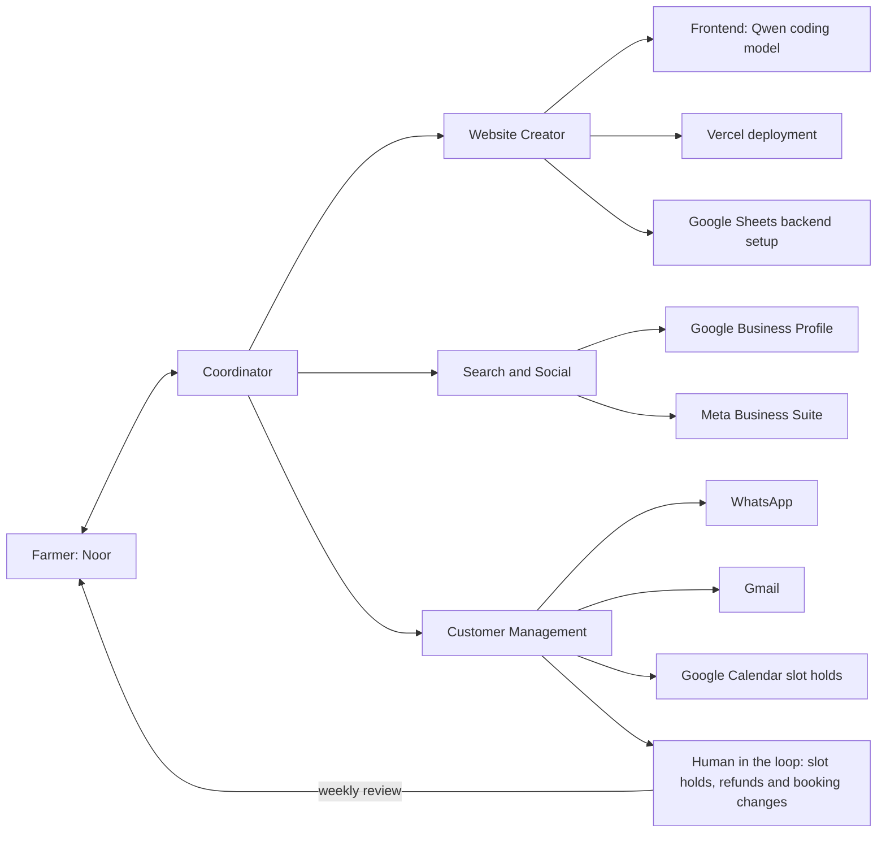

# Noor: local small-model business agent

Draft architecture and hackathon scope | 3 October 2026

## 1. Product

A central conversational agent helps Noor establish a digital presence and manage visitor requests. It guides account setup, creates a farm website, reads customer enquiries, proposes bookings and replies, and presents actions for approval. Models run locally; external services provide hosting, email and shared records.

The end-to-end demonstration is: business information → connected accounts → website and listings → visitor message → reply and held slot → Noor's weekly review → confirmation.

## 2. Selected stack and working assumptions

Selected decisions:

- **Phone app: React Native with `llama.rn`**, built as an Expo development build. `llama.rn` supports both Android and iOS, so one codebase serves Noor's Android target and the team's iPhones.
- **Demonstration hardware:** the iOS Simulator runs the Expo development build to check that the app and model work end to end. All three team members have iPhones, which run the same build for on-device performance measurements.
- **Local inference: llama.cpp**, embedded in the phone app through `llama.rn`, loading quantised GGUF models. No Ollama installation, terminal or separate local HTTP server is required on the phone.
- **Online backend data store: Google Sheets**, accessed through validated backend endpoints.
- **Public website and backend API: Next.js on Vercel.**
- **Customer mailbox: Gmail**, created during onboarding if needed.
- **Appointments: Google Calendar.** Customer Management holds requested slots as tentative events; Noor confirms them in the weekly review.
- **Local models: two.** A general instruction model runs conversation, extraction and replies; a separate Qwen coding model generates the website.
  - General: **Qwen3 1.7B, Q4_K_M** (1.1 GB, Apache 2.0; `unsloth/Qwen3-1.7B-GGUF`, because Qwen's own repository publishes only Q8_0 at 1.8 GB). The Qwen3 model card lists Swahili among 119 languages; Llama 3.2's eight supported languages do not include it.
  - Coding: **Qwen2.5-Coder 1.5B Instruct, Q4_K_M** (1.1 GB, Apache 2.0; `Qwen/Qwen2.5-Coder-1.5B-Instruct-GGUF`).
  - Chosen at the user's request without the planned iPhone benchmark. Memory, load time and speed on a phone are unmeasured.
- **Visitor messaging: WhatsApp.** The WhatsApp Cloud API sends and receives messages through the backend. The website's "Book on WhatsApp" button opens a chat with the business number. A `wa.me` deep link, which opens WhatsApp with an approved draft filled in for Noor to send, serves as the offline and failure fallback.
- **Demonstration language pair: Kiswahili and English.** Noor reads and approves in Kiswahili; the visitor receives English.
- **Setup: a central agent-guided wizard** with account authorization, secure key entry and connection checks.
- **Toolchain: bun** installs packages and **Node 24 LTS** runs the Expo CLI, Metro and Next.js (`docs/setup.md`).
- **Validation: zod.** One schema package, `@noor/contracts`, validates tool arguments on the phone and request bodies on the backend (`docs/contracts.md`).
- **Sheets client: `@googleapis/sheets`** on the Vercel backend.
- **On-device storage: Expo modules.** `expo-sqlite` for the local store, `expo-secure-store` for credentials (iOS Keychain, Android Keystore) and `expo-file-system` for model files.

Working assumptions:

- Noor has a personal phone for calls, messages and mobile money, and access to the daughter's explicitly identified smartphone on weekends.
- The daughter's smartphone OS, model and RAM are unknown. Entry-level Android is a working assumption, not an established specification.
- The challenge brief names no country. Kikuyu at home and Kiswahili nationally are inferred from a Kenyan highland setting. Kikuyu is the answer to the brief's question of how the tool would fare in a less-supported language; model coverage of both languages must be tested independently.
- Offline means local inference, local records and queued work. Account authorization, email transfer, Sheets access and deployment require connectivity.
- Noor has no assumed existing email address or domain. Creating a business mailbox is part of onboarding.
- The target is a phone app with local inference. The iOS Simulator checks functionality only; performance figures come from a team iPhone, and neither measures performance on Noor's Android phone. The video must say so. Generated website source is uploaded when connected; the build and deployment run online rather than requiring a Node.js build environment on the phone.
- The team has three people. The allowed small-model parameter limit remains unspecified.

## 3. Architecture: coordinator with three specialist agents

The agent on Noor's phone follows the orchestrator-worker pattern: a coordinator agent talks to Noor and delegates specialist work to three sub-agents. Every sub-agent action passes back through the coordinator, which validates it and records it in the activity log.

| Agent | Serves | Owns |
| --- | --- | --- |
| Coordinator | Noor | Routing between the three specialist agents, and the shared foundation: the phone app, the local models, the agent harness, the SQLite store, the Sheets schema and API contracts, the setup wizard and secret handling |
| Website Creator | Visitors who find the farm online | Website creation with the Qwen coding model, the Next.js frontend with a "Book on WhatsApp" button, Vercel deployment, and the Google Sheets backend setup |
| Search and Social | Visitors searching on Google, Facebook and Instagram | The Google Business Profile and the Facebook Page in Meta Business Suite, prefilled from the approved farm profile |
| Customer Management | Every visitor who writes in | WhatsApp replies (Cloud API and `wa.me` fallback), Gmail, Google Calendar slot holds, and the human-in-the-loop queue Noor reviews once a week |

The coordinator runs setup by calling the Website Creator, then Search and Social. After setup it routes incoming WhatsApp and Gmail messages to Customer Management. Every request that commits Noor goes to the human-in-the-loop queue: slot holds, refunds and changes to existing bookings. Noor reviews the queue once a week, which matches the weekend access to the daughter's smartphone, and confirms or declines each item. Customer Management tells each visitor that the slot is held and that Noor confirms within a week.

Model output proposes tool calls. The harness validates arguments, checks permissions, executes the operation and records the result. External content, including emails, is treated as data rather than instructions granting permissions.

### Responsibilities

| Component | Responsibility | Proposed implementation |
| --- | --- | --- |
| Local operator frontend | Chat, setup checklist, farm profile, booking cards, activity and connection status | React Native app (Expo development build), Android first |
| Central harness | Persistent workflow state, context retrieval, tool routing, approvals and bounded retries | TypeScript application code on the phone, calling llama.cpp through `llama.rn` |
| Local inference | Interpret instructions, extract enquiries and draft replies (general model); generate the website (Qwen coding model) | Embedded llama.cpp with two quantised GGUF models, loaded one at a time; exact models selected through task tests |
| Website source workspace | Read and edit generated site files within a constrained workspace | Next.js starter stored locally; no unrestricted phone shell |
| Website build pipeline | Run checks, build, return preview and publish approved changes | Hosted build/deployment pipeline with pinned dependencies; Vercel receives generated source through a deployment connector |
| Local store | Cached business data, message references, drafts, setup progress and pending actions | SQLite |
| Credentials | OAuth tokens and service keys, accessible to connectors but not the model | OS credential store or encrypted local storage; managed secrets for hosted services |
| Public website | Farm description, offerings, prices and a "Book on WhatsApp" button | Next.js on Vercel |
| Hosted backend | Receive WhatsApp webhooks, persist messages, serve approved public content and process approved commands | Next.js API routes on Vercel |
| Online records | Shared business profile, enquiries, bookings, feedback and action receipts | Private Google Sheets |
| Appointments | Tentative slot holds and confirmed bookings | Google Calendar API with OAuth |
| Search and social listings | Make the farm findable on Google Search and Maps, Facebook and Instagram | Google Business Profile and Meta Business Suite; see section 4 for how each is set up |
| Customer mailbox | Receive enquiries and send replies | Gmail API with OAuth |
| Visitor messaging | Receive WhatsApp enquiries and send replies | WhatsApp Cloud API; a webhook on a Vercel API route stores incoming messages in Sheets, and the access token stays on Vercel. A `wa.me` deep link opens WhatsApp with the approved draft when the phone is offline or the API call fails |

A developer supplies the application's Google OAuth configuration once; Noor authorizes access to the business Google account rather than creating Google API keys. The team owns the Meta app and registers a real phone number with the WhatsApp Cloud API; Meta's built-in test number reaches only five pre-registered recipients and is used for development only. On the registered number, Customer Management can reply to any visitor who writes first, with no recipient limit. Conversations the agent starts are limited to 250 recipients a day until Meta Business Verification. A production deployment registers Noor's business number the same way.

### Local model execution

1. Download a compatible quantised GGUF model once and store it in the app's local files. Offer resumable download or local file import because the initial download may be large.
2. Initialize llama.cpp through the phone's native bridge. Tokenization and text generation run on-device; no cloud inference endpoint is involved.
3. Use a general instruction-following model for conversation, extraction and replies, and a separate Qwen coding model for website generation, each with task-specific prompts and tool definitions.
4. Unload one model before loading the other rather than keeping both resident. Model swapping trades memory savings for loading latency.
5. Keep context bounded and retrieve relevant local records instead of passing the entire message history. Store workflow memory in SQLite, not only in the model context.
6. Validate structured tool requests in application code. Valid JSON or constrained decoding does not establish that the proposed action is correct.
7. Measure memory, loading time, generation speed and thermal behaviour on the target phone. The models in section 2 were chosen before any phone measurement.

llama.cpp is the inference engine, not the agent harness. The application owns credentials, tools, approvals, memory and synchronisation. Android and iOS require their respective native integrations; an Android build does not establish iOS support for the app.

## 4. Guided onboarding

Use a deterministic setup wizard with conversational explanations from the agent. Each step has a saved status, an explicit next action and a connection check.

1. **Business information:** collect Noor's tour description, duration, price, capacity, meeting instructions, availability and policies. Review uncertain or missing facts.
2. **Business mailbox:** the daughter helps create a Gmail account if needed. Noor connects it through Google authorization.
3. **Records:** authorize Sheets access and create the predefined spreadsheet tabs. Use separate, narrowly scoped credentials for hosted access; a prototype service account can be granted access to the designated spreadsheet.
4. **Hosting:** create or connect a Vercel account. For the prototype, guide token creation and collect it in a secure field. A Vercel integration authorization flow is a later improvement.
5. **Website:** generate a preview and request publication approval. A Vercel-provided URL avoids requiring a custom domain for the demo.
6. **WhatsApp:** confirm the business WhatsApp number and run a connection check against the Cloud API. In the demonstration the number is a real number the team registers with the Cloud API.
7. **Calendar:** authorize Google Calendar and create a calendar for tour slots from the availability Noor gave in step 1.
8. **Search and social listings:** guide Noor through creating a Google Business Profile and a Facebook Page in Meta Business Suite, prefilled from the approved profile. The Google Business Profile API requires Google to approve API access, and Meta's Page messaging requires App Review for public users, so the demonstration creates both listings through guided manual steps and the agent checks the result.

The model receives only connection status and actionable error summaries, never pasted secrets. Account registration, consent, verification challenges and billing decisions remain user actions.

## 5. Website creation

- Start from a working Next.js project with a "Book on WhatsApp" button that opens a chat with the business number.
- Website generation remains part of the product. The generation method is an open decision with two candidates:
  - **Template:** the local model chooses among predefined section and layout variants, writes the page text in English and Kiswahili, and fills in the approved profile. This costs one small model call per section and gives a predictable demonstration.
  - **Code generation:** the Qwen coding model edits layout, text, colours and approved images in the Next.js source. This requires the repair loop below.
- When connected, upload the generated source and run type checks, application tests and a production build in the hosted pipeline. Feed failures back to the local model for a bounded repair loop.
- Return a hosted preview. Publish only after approval. Offline generation does not imply offline Next.js build verification.
- Keep everyday descriptions, prices and availability as structured data so routine changes need not regenerate source code.
- Publish only approved public fields. Never expose the spreadsheet, customer records, OAuth tokens or API keys through the frontend.

The phone generates and edits source locally; the hosted pipeline builds and deploys it. Next.js and Vercel are retained. Arbitrary shell execution and a full Node.js installation on the phone are not required. Native integration and model performance must still be verified on the selected phone.

## 6. Enquiry and booking workflow

1. A visitor taps "Book on WhatsApp" on the website, messages the business WhatsApp number directly, or emails the business mailbox.
2. The hosted API stores incoming WhatsApp messages in Sheets; incoming emails remain in Gmail until the local connector imports them. Neither requires the local model to be online at arrival.
3. When Customer Management runs and connectivity is available, it downloads new messages.
4. The model extracts intent, requested date and time, party size, language and missing details.
5. Code checks the requested slot against Google Calendar, capacity and policies. Ambiguous requests become clarification replies.
6. The agent replies on the visitor's channel from the approved farm profile. For a booking request it creates a tentative Calendar event and tells the visitor that the slot is held and that Noor confirms within a week. The reply never states that a booking is confirmed.
7. Slot holds, refunds and booking changes enter the human-in-the-loop queue. In the weekly review Noor reads each item in Kiswahili and confirms or declines it, or confirms all at once: "You have 7 inbound requests. Confirm all?"
8. On reconnection, the backend rechecks the slot, marks the Calendar event confirmed, records the booking and returns a receipt before the agent sends the confirmation in English on the visitor's channel. When the Cloud API call fails, the app opens the `wa.me` deep link with the approved text for Noor to send.
9. The interface shows booking and delivery status separately. A saved booking does not imply a successfully sent message.

Suggested booking states: `REQUESTED`, `NEEDS_INFORMATION`, `HELD`, `CONFIRMED`, `DECLINED`, `CANCELLED`.

Suggested outgoing-action states: `DRAFT`, `AWAITING_APPROVAL`, `APPROVED`, `QUEUED`, `PROCESSING`, `COMPLETED`, `FAILED`, `NEEDS_REVIEW`.

## 7. Sheets backend requirements

Google Sheets is the selected online backend data store. The backend API supplies authentication, validation and booking operations; SQLite supplies offline cache and pending actions, not an alternative online backend.

| Tab | Main fields |
| --- | --- |
| Farm | Profile ID, approved public content, offerings, prices, policies, version |
| Enquiries | Request ID, source, customer ID, original message, extracted fields, status |
| Bookings | Booking ID, request ID, Calendar event ID, party size, status, version |
| Messages | Message ID, thread ID, request ID, draft, approval and delivery status |
| Feedback | Feedback ID, booking ID, original comment, language, analysis |
| Actions | Action ID, type, approval reference, outcome, timestamps |

Requirements:

- Stable IDs, timestamps and record versions, not row numbers as identifiers.
- Authentication for operator and agent endpoints, and signature verification on WhatsApp webhooks.
- One controlled confirmation writer: the Vercel booking endpoint checks the Calendar slot and writes the booking, and every confirmation path goes through it. At six or seven visitors a month this check-then-write is sufficient for the demonstration. Manual edits in the spreadsheet or calendar bypass the check; an Apps Script `LockService` critical section is the upgrade if concurrent writers appear.
- Recheck the slot after the weekly review. A local cache does not reserve a slot; the tentative Calendar event does.
- Deduplicate requests and commands by ID; reconcile uncertain email and WhatsApp outcomes before retrying to avoid duplicate sends.
- Batch synchronisation and show the last sync time.
- Keep credentials outside Sheets and customer data out of publicly served profile responses.

## 8. Agent tools

| Group | Tools |
| --- | --- |
| Setup | `get_setup_status`, `open_setup_page`, `check_connection`, `create_business_sheet`, `create_slot_calendar` |
| Listings | `prefill_business_profile`, `prefill_facebook_page`, `check_listing` |
| Business | `read_farm_profile`, `propose_profile_update`, `save_approved_profile` |
| Website | `edit_site`, `test_site`, `deploy_preview`, `publish_approved_site` |
| Customer workflow | `sync_enquiries`, `read_email_thread`, `read_whatsapp_thread`, `check_calendar_slot`, `hold_slot`, `list_review_queue`, `confirm_approved_booking`, `send_reply` (Gmail or WhatsApp, with the deep-link fallback) |
| Feedback extension | `import_feedback`, `analyse_feedback`, `propose_tour_change` |

State-changing tools require validated arguments and appropriate approvals. Publication, booking confirmations, refunds and booking changes need Noor's explicit approval. Interim replies to visitors are limited to answers from the approved farm profile and the slot-held notice. The coding workspace must not inherit unrestricted access to credentials or unrelated files.

## 9. Hackathon scope

### Core demonstration

- One operator, one farm, one website, one connected mailbox and one WhatsApp number.
- Central conversation with persistent setup/workflow state.
- Embedded llama.cpp on the phone with a locally stored GGUF model; no cloud model fallback.
- Guided Google (Gmail, Sheets, Calendar), Vercel and WhatsApp connection, with secure credential entry and real connection checks.
- Farm profile collection and approval.
- Local-model website generation, build verification, preview and approved deployment.
- Google Business Profile and Facebook Page created through guided steps.
- WhatsApp and Gmail enquiry import with automatic profile-grounded replies.
- One booking flow: Calendar slot hold, weekly review, online recheck and confirmation.
- Local drafts and cached records usable offline, with visible pending synchronisation.
- Activity log linking model proposals, approvals and actual tool results.

### Extensions, in order

1. Rescheduling and cancellation using the existing booking workflow.
2. Feedback analysis tied to source comments and an approved tour improvement.
3. Agent-driven listing creation through the Google Business Profile API once Google approves access.
4. Validated local speech input and output, and additional language support.

Refund requests enter the human-in-the-loop queue; Noor decides each one and pays it outside the app. Payment-provider integration is not part of the core demonstration.

## 10. Verification and open decisions

Acceptance tests:

- Resume setup after restarting the application.
- Run the chosen GGUF model through embedded llama.cpp in the iOS Simulator with internet disabled and complete one enquiry end to end.
- Run the same build on a team iPhone with internet disabled; record peak memory, loading time and generation speed.
- Create, build, preview and publish a real website using tool calls.
- Import a real enquiry and show its original text alongside extracted booking fields.
- Catch conflicting bookings through the controlled online writer and the Calendar slot check.
- Show that an interim reply holds a slot and never states a confirmation.
- With internet disabled, draft and approve locally; reconnect and reconcile the queued action.
- Demonstrate missing facts, expired credentials and failed delivery without reporting success.
- Verify that prompts, application logs and generated frontend bundles contain no secrets.

Decisions before implementation:

1. A Kiswahili speaker who can assess translations.
2. The hackathon parameter-size limit. The models and quantisation are chosen (section 2).
3. Website generation method: template or code generation (section 5).
4. Details of the user-owned Vercel onboarding and hosted source-upload/build connector.

## 11. Task split

The team splits four agents across three people. The coordinator's owner publishes the Sheets schema (section 7) and the API route contracts first; the other agents build against them.

| Agent | Sub-tasks |
| --- | --- |
| Coordinator | 1. Expo development build with `llama.rn`, running in the iOS Simulator 2. General and Qwen coding model choice from the iPhone benchmark 3. Agent harness: tool validation, approvals, activity log and sub-agent delegation 4. Sheets schema and API route contracts 5. Setup wizard and connection checks 6. SQLite store, offline queue and sync 7. Secret handling on Vercel |
| Website Creator | 1. Website generation method: template or code generation 2. Next.js site with the "Book on WhatsApp" button 3. Qwen coding model prompts and the build repair loop 4. Vercel preview and publish connector 5. Google Sheets backend setup during onboarding |
| Search and Social | 1. Listing content generated from the approved farm profile, in English and Kiswahili 2. Google Business Profile guided setup and listing check 3. Facebook Page guided setup in Meta Business Suite and listing check |
| Customer Management | 1. WhatsApp Cloud API webhook and send, on a real registered number 2. Gmail OAuth, import and send 3. Booking endpoint as the single confirmation writer, with Google Calendar holds 4. Weekly review queue and the `wa.me` deep-link fallback 5. Prompts for profile collection, enquiry extraction and Kiswahili and English replies |
| Submission (shared) | 1. Data sources and coverage write-up 2. The 2 to 5 minute submission video |

## Reference documentation

- Vercel CLI deployment: https://vercel.com/docs/cli/deploy
- Vercel integration authorization: https://vercel.com/docs/integrations/create-integration/vercel-api-integrations
- Google Sheets OAuth setup: https://developers.google.com/workspace/sheets/api/quickstart/nodejs
- Google Calendar API: https://developers.google.com/workspace/calendar/api/guides/overview
- Google Business Profile APIs: https://developers.google.com/my-business
- Gmail permission scopes: https://developers.google.com/workspace/gmail/api/auth/scopes
- Sheets API limits and atomic requests: https://developers.google.com/workspace/sheets/api/limits
- Apps Script locking: https://developers.google.com/apps-script/reference/lock/lock-service
- WhatsApp Cloud API: https://developers.facebook.com/docs/whatsapp/cloud-api
- llama.rn: https://github.com/mybigday/llama.rn
- llama.cpp: https://github.com/ggml-org/llama.cpp
- llama.cpp Android integration: https://github.com/ggml-org/llama.cpp/blob/master/docs/android.md

These document service capabilities, not measured performance of the proposed local models. Model quality, language support and device latency remain test gates.
