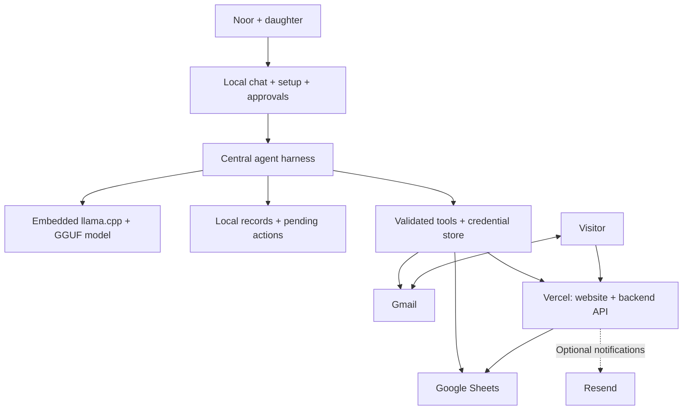

# Noor: local small-model business agent

Draft architecture and hackathon scope | 3 October 2026

## 1. Product

A central conversational agent helps Noor establish a digital presence and manage visitor requests. It guides account setup, creates a farm website, reads customer enquiries, proposes bookings and replies, and presents actions for approval. Models run locally; external services provide hosting, email and shared records.

The end-to-end demonstration is: business information → connected accounts → website preview → approved publication → customer enquiry → approved booking and response.

## 2. Selected stack and working assumptions

Selected decisions:

- **Local inference: llama.cpp**, embedded in the phone app, loading quantised GGUF models. No Ollama installation, terminal or separate local HTTP server is required on the phone.
- **Online backend data store: Google Sheets**, accessed through validated backend endpoints.
- **Public website and backend API: Next.js on Vercel.**
- **Customer mailbox: Gmail**, created during onboarding if needed; Resend remains an optional notification service.
- **Setup: a central agent-guided wizard** with account authorization, secure key entry and connection checks.

Working assumptions:

- Noor has her own phone for calls, messages and mobile money, and access to her daughter's explicitly identified smartphone on weekends.
- The daughter's smartphone OS, model and RAM are unknown. Entry-level Android is a working assumption, not an established specification.
- Kikuyu at home, Kiswahili nationally and English for the demonstration visitor are provisional language choices inferred from a Kenyan highland setting. Country and languages require confirmation; model coverage must be tested independently.
- Offline means local inference, local records and queued work. Account authorization, email transfer, Sheets access and deployment require connectivity.
- Noor has no assumed existing email address or domain. Creating a business mailbox is part of onboarding.
- The target is a phone app with local inference. A laptop can be used for development and debugging, not as a substitute for the target architecture. Generated website source is uploaded when connected; the build and deployment run online rather than requiring a Node.js build environment on the phone.
- Hackathon duration, team size and the allowed small-model parameter limit remain unspecified.

## 3. Architecture

Model output proposes tool calls. The harness validates arguments, checks permissions, executes the operation and records the result. External content, including emails, is treated as data rather than instructions granting permissions.

### Responsibilities

| Component | Responsibility | Proposed implementation |
| --- | --- | --- |
| Local operator frontend | Chat, setup checklist, farm profile, booking cards, activity and connection status | Phone app; Kotlin + Jetpack Compose as the Android implementation proposal |
| Central harness | Persistent workflow state, context retrieval, tool routing, approvals and bounded retries | Application code on the phone, calling llama.cpp through native bindings |
| Local inference | Interpret instructions, extract enquiries, draft replies and generate website changes | Embedded llama.cpp with quantised GGUF; exact model selected through task tests |
| Website source workspace | Read and edit generated site files within a constrained workspace | Next.js starter stored locally; no unrestricted phone shell |
| Website build pipeline | Run checks, build, return preview and publish approved changes | Hosted build/deployment pipeline with pinned dependencies; Vercel receives generated source through a deployment connector |
| Local store | Cached business data, message references, drafts, setup progress and pending actions | SQLite |
| Credentials | OAuth tokens and service keys, accessible to connectors but not the model | OS credential store or encrypted local storage; managed secrets for hosted services |
| Public website | Farm description, offerings, contact and booking request form | Next.js on Vercel |
| Hosted backend | Validate public submissions, persist requests, serve approved public content and process approved commands | Next.js API routes on Vercel |
| Online records | Shared business profile, availability, enquiries, bookings, feedback and action receipts | Private Google Sheets |
| Customer mailbox | Receive enquiries and send Noor-approved responses | Gmail API with OAuth |
| Optional email service | Platform notifications and domain-based business email | Resend; requires a verified sender domain for general outbound delivery |

Gmail is the default mailbox route. Resend is optional, not a prerequisite. A developer supplies the application's Google OAuth configuration once; Noor authorizes access to her account rather than creating Google API keys.

### Local model execution

1. Download a compatible quantised GGUF model once and store it in the app's local files. Offer resumable download or local file import because the initial download may be large.
2. Initialize llama.cpp through the phone's native bridge. Tokenization and text generation run on-device; no cloud inference endpoint is involved.
3. Start with one instruction-following model for conversation and coding, using task-specific prompts and tool definitions. A separate coding model is added only if evaluation justifies it.
4. If two models are used, unload one before loading the other rather than keeping both resident. Model swapping trades memory savings for loading latency.
5. Keep context bounded and retrieve relevant local records instead of passing the entire message history. Store workflow memory in SQLite, not only in the model context.
6. Validate structured tool requests in application code. Valid JSON or constrained decoding does not establish that the proposed action is correct.
7. Benchmark memory, loading time, generation speed and thermal behaviour on the actual target phone before fixing the model and quantisation. Model choice remains open; runtime choice does not.

llama.cpp is the inference engine, not the agent harness. The application owns credentials, tools, approvals, memory and synchronisation. Android and iOS require their respective native integrations; an Android build does not establish iOS support for the app.

## 4. Guided onboarding

Use a deterministic setup wizard with conversational explanations from the agent. Each step has a saved status, an explicit next action and a connection check.

1. **Business information:** collect Noor's tour description, duration, price, capacity, meeting instructions, availability and policies. Review uncertain or missing facts.
2. **Business mailbox:** her daughter helps create a Gmail account if needed. Noor connects it through Google authorization.
3. **Records:** authorize Sheets access and create the predefined spreadsheet tabs. Use separate, narrowly scoped credentials for hosted access; a prototype service account can be granted access to the designated spreadsheet.
4. **Hosting:** create or connect a Vercel account. For the prototype, guide token creation and collect it in a secure field. A Vercel integration authorization flow is a later improvement.
5. **Website:** generate a preview and request publication approval. A Vercel-provided URL avoids requiring a custom domain for the demo.
6. **Optional Resend:** configure an account and verified domain only if this route is selected. Show DNS instructions and verification status.

The model receives only connection status and actionable error summaries, never pasted secrets. Account registration, consent, verification challenges and billing decisions remain user actions.

## 5. Website creation

- Start from a working Next.js project with a booking form and backend contract already implemented.
- Let the local coding model customize layout, text, colours and approved images. Website generation remains part of the product; it is not limited to filling text into a single fixed design.
- When connected, upload the generated source and run type checks, application tests and a production build in the hosted pipeline. Feed failures back to the local model for a bounded repair loop.
- Return a hosted preview. Publish only after approval. Offline generation does not imply offline Next.js build verification.
- Keep everyday descriptions, prices and availability as structured data so routine changes need not regenerate source code.
- Publish only approved public fields. Never expose the spreadsheet, customer records, OAuth tokens or API keys through the frontend.

The phone generates and edits source locally; the hosted pipeline builds and deploys it. Next.js and Vercel are retained. Arbitrary shell execution and a full Node.js installation on the phone are not required. Native integration and model performance must still be verified on the selected phone.

## 6. Enquiry and booking workflow

1. A visitor submits the website form or emails the business mailbox.
2. The hosted API stores form submissions in Sheets; incoming emails remain in Gmail until the local connector imports them. Neither requires the local model to be online at arrival.
3. When the agent runs and connectivity is available, it downloads new requests and messages.
4. The model extracts intent, requested date/time, party size, language and missing details. It drafts a grounded response using the approved farm profile.
5. Code checks availability, capacity and policies. Ambiguous requests become clarification drafts.
6. Noor reviews a booking card and reply in a language she understands.
7. Approval queues a command. On reconnection, the backend rechecks current availability, records the booking and returns a receipt before the agent sends a confirmation.
8. The interface shows booking and delivery status separately. A saved booking does not imply a successfully sent email.

Suggested booking states: `REQUESTED`, `NEEDS_INFORMATION`, `PROPOSED`, `CONFIRMED`, `DECLINED`, `CANCELLED`.

Suggested outgoing-action states: `DRAFT`, `AWAITING_APPROVAL`, `APPROVED`, `QUEUED`, `PROCESSING`, `COMPLETED`, `FAILED`, `NEEDS_REVIEW`.

## 7. Sheets backend requirements

Google Sheets is the selected online backend data store. The backend API supplies authentication, validation and booking operations; SQLite supplies offline cache and pending actions, not an alternative online backend.

| Tab | Main fields |
| --- | --- |
| Farm | Profile ID, approved public content, offerings, prices, policies, version |
| Availability | Slot ID, date/time, capacity, closures |
| Enquiries | Request ID, source, customer ID, original message, extracted fields, status |
| Bookings | Booking ID, request ID, slot ID, party size, status, version |
| Messages | Message ID, thread ID, request ID, draft, approval and delivery status |
| Feedback | Feedback ID, booking ID, original comment, language, analysis |
| Actions | Action ID, type, approval reference, outcome, timestamps |

Requirements:

- Stable IDs, timestamps and record versions, not row numbers as identifiers.
- Authentication for operator/agent endpoints, validation and abuse controls on public forms.
- One controlled confirmation writer. If using Apps Script, put availability check and booking write inside a `LockService` critical section; all confirmation paths must use it. Direct manual edits are not protected by that lock.
- Recheck availability after offline approval. A local cache does not reserve a slot.
- Deduplicate requests and commands by ID; reconcile uncertain email outcomes before retrying to avoid duplicate sends.
- Batch synchronisation and show the last sync time.
- Keep credentials outside Sheets and customer data out of publicly served profile responses.

## 8. Agent tools

| Group | Tools |
| --- | --- |
| Setup | `get_setup_status`, `open_setup_page`, `check_connection`, `create_business_sheet` |
| Business | `read_farm_profile`, `propose_profile_update`, `save_approved_profile` |
| Website | `edit_site`, `test_site`, `deploy_preview`, `publish_approved_site` |
| Customer workflow | `sync_enquiries`, `read_email_thread`, `check_availability`, `propose_booking`, `confirm_approved_booking`, `send_approved_reply` |
| Feedback extension | `import_feedback`, `analyse_feedback`, `propose_tour_change` |

State-changing tools require validated arguments and appropriate approvals. Publication and customer messages need explicit approval. The coding workspace must not inherit unrestricted access to credentials or unrelated files.

## 9. Hackathon scope

### Core demonstration

- One operator, one farm, one website and one connected mailbox.
- Central conversation with persistent setup/workflow state.
- Embedded llama.cpp on the phone with a locally stored GGUF model; no cloud model fallback.
- Guided Google and Vercel connection, with secure credential entry and real connection checks.
- Farm profile collection and approval.
- Local-model website customization, build verification, preview and approved deployment.
- Website and Gmail enquiry import.
- One booking flow with availability validation, approval, online recheck and customer response.
- Local drafts and cached records usable offline, with visible pending synchronisation.
- Activity log linking model proposals, approvals and actual tool results.

### Extensions, in order

1. Rescheduling and cancellation using the existing booking workflow.
2. Feedback analysis tied to source comments and an approved tour improvement.
3. Resend-based notifications or provisioned business addresses.
4. Social presence and marketing integrations from the whiteboard.
5. Validated local speech input/output and additional language support.

Payments and refunds require separate payment-provider integration and approval design. They are not claimed in the core demonstration.

## 10. Verification and open decisions

Acceptance tests:

- Resume setup after restarting the application.
- Run the chosen GGUF model through embedded llama.cpp on the target phone with internet disabled; record peak memory, loading time and generation speed.
- Create, build, preview and publish a real website using tool calls.
- Import a real enquiry and show its original text alongside extracted booking fields.
- Catch conflicting bookings through the controlled online writer.
- With internet disabled, draft and approve locally; reconnect and reconcile the queued action.
- Demonstrate missing facts, expired credentials and failed delivery without reporting success.
- Verify that prompts, application logs and generated frontend bundles contain no secrets.

Decisions before implementation:

1. Target phone OS, RAM and processor, to select the native integration and usable GGUF size.
2. Exact language pair and a speaker who can assess translations.
3. Exact local model, quantisation and hackathon parameter-size limit; whether a separate coding model is justified by tests.
4. Details of the user-owned Vercel onboarding and hosted source-upload/build connector.
5. Whether optional Resend notifications fit the demo; Gmail remains the baseline mailbox.
6. Hackathon time/team budget, to determine which extensions fit.

## Reference documentation

- Vercel CLI deployment: https://vercel.com/docs/cli/deploy
- Vercel integration authorization: https://vercel.com/docs/integrations/create-integration/vercel-api-integrations
- Google Sheets OAuth setup: https://developers.google.com/workspace/sheets/api/quickstart/nodejs
- Gmail permission scopes: https://developers.google.com/workspace/gmail/api/auth/scopes
- Sheets API limits and atomic requests: https://developers.google.com/workspace/sheets/api/limits
- Apps Script locking: https://developers.google.com/apps-script/reference/lock/lock-service
- Resend inbound email: https://www.resend.com/blog/inbound-emails
- llama.cpp: https://github.com/ggml-org/llama.cpp
- llama.cpp Android integration: https://github.com/ggml-org/llama.cpp/blob/master/docs/android.md

These document service capabilities, not measured performance of the proposed local models. Model quality, language support and device latency remain test gates.
